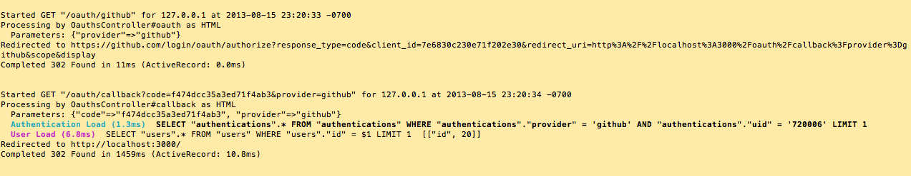
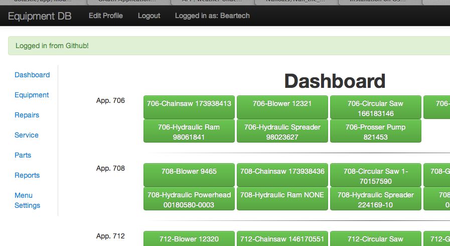

== README

EquipDB is a program to manage and track service and repairs on small power equipment.

Omniauth integration is on the omniauth branch.

When logging in with github you can see the info received from github which the program then
uses to look up the user in the user table.

The second photo shows the notification after logging in.

